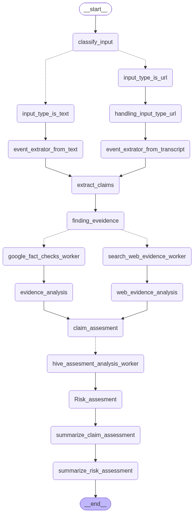

#### version2 first architecture map


```text

                  Claim
                    │
                    ▼
           News Search Router
                    │
                    ▼
          LLM understands claim
                    │
                    ▼
             NewsAPI Search
                    │
                    ▼
              10 Articles
                    │
                    ▼
       Claim ↔ Article similarity
                    │
          similarity >= 0.80
                    │
                    ▼
        Relevant Articles
                    │
                    ▼
       extract_webpage_content()
                    │
                    ▼
           Full article text
                    │
                    ▼
          ┌─────────────────┐
          │       LLM       │
          │                 │
          │ supports        │
          │ contradicts     │
          │ neutral         │
          └─────────────────┘
             │       │
             │       │
             ▼       ▼
        supporting  contradicting
        
```
>future improvment

```text
claim
  ↓
NewsAPI 10 articles
  ↓
title + description embedding
  ↓
candidate filtering
  ↓
full webpage extraction
  ↓
chunk article
  ↓
claim ↔ chunks similarity
  ↓
top relevant chunks
  ↓
LLM supports/contradicts/neutral
```